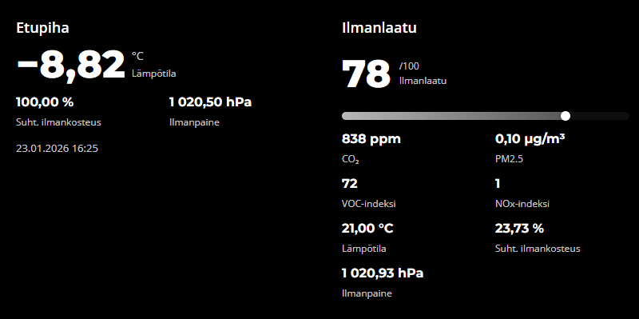

# Module for [MagicMirror](https://magicmirror.builders/): Ruuvi api sensors

The `MMM-ruuvi-api-sensors` module fetches Ruuvi sensors data from User API (https://docs.ruuvi.com/communication/cloud/user-api).


## Screenshot



## Using the module

1) Clone this repository under `MagicMirror/modules` folder
2) Run `npm install` in `MagicMirror/modules/MMM-ruuvi-api-sensors` folder
3) Add to the modules array in the `MagicMirror/config/config.js` file:
````javascript
modules: [{
	module: "MMM-ruuvi-api-sensors",
	position: "top_right",
	header: "Ruuvi measurements",
	config: {
                updateInterval: 5 * 1000 * 60, // every 5 minutes
                apiUrl: 'https://network.ruuvi.com',
                token: '<TOKEN>',
                width: 800,
                cardBackground: '',
                showAqiColors: false
	}
}]
````

## Configuration options

The following properties can be configured:


| Option                       	| Default value               | Description
| -----------------------------	| --------------------------- | -----------
| `updateInterval`				| `30000`                     | Update interval in milliseconds. Limited minumum value for 1 minute because API blocks faster updates.
| `apiUrl`						| `https://network.ruuvi.com` | Api url
| `token`                       |                             | **Necessary** own token, get it: <br>- Register user or reset token: Send POST message with following body ```{"email": "your@email.com"}``` to `https://network.ruuvi.com/register`<br>- Verify account: Send GET message with `token` parameter to `https://network.ruuvi.com/verify?token=<TOKEN IN YOUR EMAIL>`<br>- When verified account you get response JSON where your acces token is<br><br>read more: https://docs.ruuvi.com/communication/cloud/user-api
| `width`                       | `800`                       | wrapper width, if you want cards to one col decrease value, if you want more than 2 cols increase value
| `cardBackGround`              |                             | card bacground, empty string is transparent. For example gray gradient: `linear-gradient(180deg, #3b3b3b 0%, #2f2f2f 100%)`
| `showAqiColors`               | `false`                       | Show air quality (aqi) points in colors |
