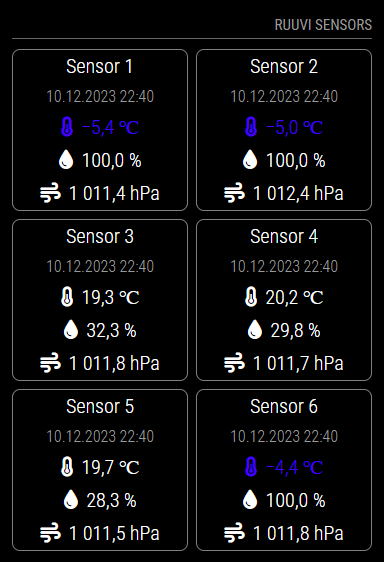
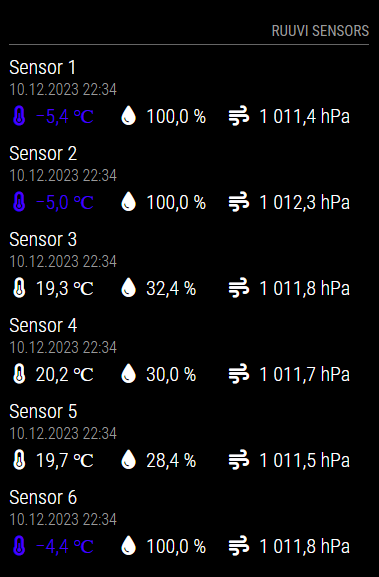

# Module for [MagicMirror](https://magicmirror.builders/): Ruuvi api sensors

The `MMM-ruuvi-api-sensors` module fetches Ruuvi sensors data from User API (https://docs.ruuvi.com/communication/cloud/user-api).


## Screenshot

### Col style (default)



### Row style



## Using the module

1) Clone this repository under `MagicMirror/modules` folder
2) Run `npm install` in `MagicMirror/modules/MMM-ruuvi-api-sensors` folder
3) Add to the modules array in the `MagicMirror/config/config.js` file:
````javascript
modules: [{
	module: "MMM-ruuvi-api-sensors",
	position: "top_right",
	header: "Ruuvi measurements",
	config: {
		temperatureIcon: 'temperature-half',
        pressureIcon: 'wind',
        humidityIcon: 'droplet',
        batteryEmptyIcon: 'battery-half',
        updateInterval: 5 * 1000 * 60, // every 5 minutes
        apiUrl: 'https://network.ruuvi.com',
        token: '<TOKEN>',
        negativeColor: '#4800FF',
        highlightNegative: true,
        uiStyle: 'col'
	}
}]
````

## Configuration options

The following properties can be configured:


| Option                       	| Default value               | Description
| -----------------------------	| --------------------------- | -----------
| `temperatureIcon`			    | `temperature-half`          | Temperature icon. See others: https://fontawesome.com/icons?d=gallery
| `pressureIcon`				| `wind`                      | Pressure icon. See others: https://fontawesome.com/icons?d=gallery
| `humidityIcon`				| `droplet`                   | Humidity icon. See others: https://fontawesome.com/icons?d=gallery
| `batteryEmptyIcon`			| `battery-half`              | Battery empty icon. See others: https://fontawesome.com/icons?d=gallery
| `updateInterval`				| `30000`                     | Update interval in milliseconds. Limited minumum value for 1 minute because API blocks faster updates.
| `apiUrl`						| `https://network.ruuvi.com` | Api url
| `token`                       |                             | **Necessary** own token, read more: https://docs.ruuvi.com/communication/cloud/user-api
| `negativeColor`               | `#4800FF`                   | Highlight negative value this color
| `highlightNegative`           | `true`                      | Higlight negative measurements true/false
| `uiStyle`                     | `col`                       | UI style `col` or `row`
